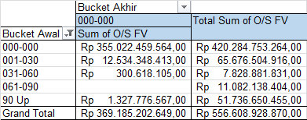

Data analytics in finance involves using data and statistical techniques to analyze financial data to identify patterns, trends, and relationships that can inform financial decision making. Fundamental aspects of data analytics in finance include:

1. Data Collection: Gathering financial data from various sources such as market data, transaction data, and news data.

2. Data Cleaning: Removing errors, inconsistencies, and irrelevant information from the data to improve the quality of analysis.

3. Data Visualization: Representing financial data graphically to make it easier to understand and identify trends and patterns.

4. Descriptive Analytics: Summarizing the financial data to describe what happened and why.

5. Predictive Analytics: Using statistical and machine learning models to forecast future events based on historical data.

6. Prescriptive Analytics: Using advanced optimization and simulation models to suggest actions that can optimize financial outcomes.

7. Data Management: Storing and organizing financial data to make it accessible for analysis and reporting.

These fundamental aspects form the foundation of data analytics in finance and can be applied to various financial domains such as risk management, investment management, and fraud detection.

# Project

# Asking the right question
### PT XYZ has Account Receivable data for the closing period February 28, 2022. From the data, the questions that can be asked are:
1. How much is there (in rupiah) payment of receivables from last period (January) to this period (February)
2. How many amounts (in rupiah) of receivables payments have deteriorated in this period
3. How many are there (in percent) receivables that returned current in this period this period?
4. How much (in rupiah) is the amount of receivables that have difficulty paying (Non-performing Financing)

## Data Cleansing Process
1. Ensure there are no there are no blank values in the data set
2. Sort the number sequence that was originally out of sequence
3. Uniformize the data type of each column (example: Number, Date, Currency)

## Descriptive Analysis

## Data Summary

## Current to Current 
Current to Current is a condition of payment of receivables that in the previous period was smooth,and in this period is also current (paid before maturity). Based on summary data, PT XYZ has IDR 355,022,459,564 (84.47%) of current receivables for the period of February 28, 2022. This amount is still relatively good because most customers are still able to pay before the due date.

How much is there (in rupiah) payment of receivables from last period (January) to this period (February) ?

## Rate Flow

Rate Flow is the value for the condition of receivables payments that are getting worse in this period. Based on the summary data, PT XYZ has an average of Rp 28,328,151,313.50 receivables whose payments are getting worse in the closing period of February 28, 2022.

* With Rp 65,262,293,700 receivables that were previously paid before maturity, then became delinquent in the first month.

* Rp 39,180,894,093.00 receivables that were previously in arrears for 1 month, then again in arrears in the 2nd month.

* Rp 5,773,323,936.00 receivables that were previously 2 months in arrears, then became delinquent again in the 3rd month.

* Rp 3,096,093,525.00 receivables that were previously in arrears for 2 months, then again in arrears in the 4th month etc.

## Back to Current

Back to Current is the condition of payment of receivables that were not smooth, then returned to smooth (paid before maturity). Based on the existing summary data, there are 10% of receivables that are paid back before maturity at PT XYZ for the closing period February 28, 2022. The 10% percentage needs to be further investigated for the cause, because the receivables that return to current are still relatively low.

How many are there (in percent) receivables that returned current in this period this period ?

